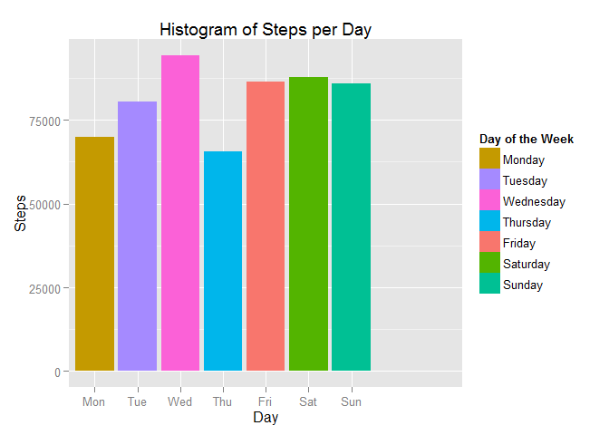
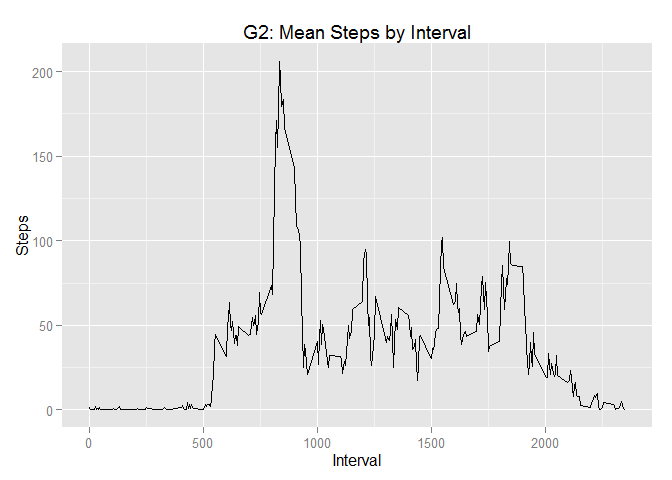
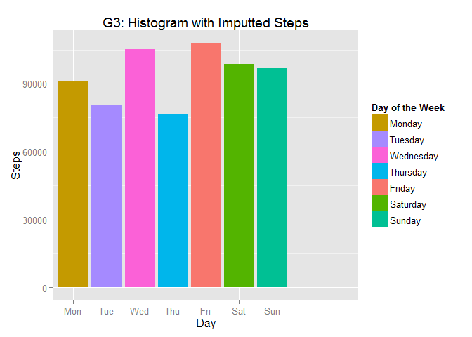
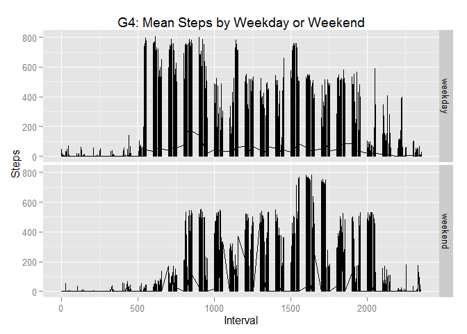

# Reproducible Research: Peer Assessment 1


## Loading and preprocessing the data

Following is the code to load the activity.csv dataset into a data table. First, date is converted from a chr class to a date class and a weekday factor is determined from the date. Next, average steps per interval are computed. Finally, average steps are merged with the activity table.


```r
library(data.table)
```

```
## Warning: package 'data.table' was built under R version 3.1.3
```

```r
# Load the csv file into a dataframe.  
chrFile = "data/activity.csv"
dtAct <- data.table(read.csv(chrFile, header=TRUE, sep=',', na.strings="NA", 
                             check.names=FALSE, stringsAsFactors=FALSE, comment.char=""))

# Convert date from chr to date
dtAct$date <- as.Date(dtAct$date, format="%Y-%m-%d")
# Create a weekday factor
dtAct$weekday <- as.factor(weekdays(dtAct$date))
# Create a vector of day of the week numbers
dtAct$day = ifelse(wday(dtAct$date)==1,7,wday(dtAct$date)-1)

# Put mean steps into dtAct
dfAvgSteps <- as.data.frame(dtAct[, mean(steps, na.rm = TRUE), by = interval])
colnames(dfAvgSteps)[2] <- "meansteps"

# Convert to data.table
dtAvgSteps <- data.table(dfAvgSteps)

# Set keys to do merge
setkey(dtAct, "interval")
setkey(dtAvgSteps, "interval")
dtAct <- merge(dtAct, dtAvgSteps)
```

## What is mean total number of steps taken per day?

Following is a histogram of the total number of steps taken per day.


```r
library(ggplot2, warn.conflicts = FALSE, quietly=TRUE)
```

```
## Warning: package 'ggplot2' was built under R version 3.1.3
```

```r
# Plot interval with day of week colored for each bar
ppgDayWeek <- ggplot(dtAct, aes(x=day, y=steps, fill=factor(weekday))) + 
            stat_summary(fun.y="sum", geom="bar", na.rm = TRUE) +
            scale_x_discrete(breaks=c(1:7),
            labels=c("Mon","Tue","Wed","Thu","Fri","Sat","Sun")) +
            ggtitle("G1: Histogram of Steps per Day") + xlab("Day") + ylab("Steps") +
            scale_fill_discrete(name="Day of the Week", breaks = dtAct$weekday)

print(ppgDayWeek)
```

 

Following is the mean and median of steps.


```r
mean(dtAct$mean, na.rm = TRUE)
```

```
## [1] 37.3826
```

```r
median(order(dtAct$mean), na.rm = TRUE)
```

```
## [1] 8784.5
```

From graph 1 above and the mean and median, one can say that during week days the total number of steps rises through Monday, Tuesday and Wednesday. Total number of steps for Thursday drops. Then, total number of steps for Friday, Saturday and Friday rise to the about the same number of steps. The average number of steps per interval is about 37.3 and the median is about 8,784 which is unreasonable as a statistic without considering missing values and intervals.

## What is the average daily activity pattern?

Following is a time series plot of the 5-minute interval (x-axis) and the average number of steps taken, averaged across all days (y-axis).


```r
ggpMeanSteps = ggplot(dtAct, aes(interval, meansteps, type = "l")) + 
      geom_line() +
      labs(title="G2: Mean Steps by Interval") + xlab("Interval") + ylab("Steps")

print(ggpMeanSteps)
```

 

```r
dfAvgSteps <- as.data.frame(dtAct[, mean(steps, na.rm = TRUE),by = interval])
colnames(dfAvgSteps)[2] <- "mean"
mean(dfAvgSteps$mean)
```

```
## [1] 37.3826
```

```r
dfMdnSteps <- as.data.frame(dtAct[, median(order(steps), na.rm = TRUE),by = interval])
colnames(dfMdnSteps)[2] <- "median"
median(order(dfMdnSteps$median))
```

```
## [1] 144.5
```

The following shows which 5-minute interval, on average across all the days in the dataset, contains the maximum number of steps. The maximum number of steps is 806 and it occurs at interval 615. 


```r
summary(dtAct$steps)
```

```
##    Min. 1st Qu.  Median    Mean 3rd Qu.    Max.    NA's 
##    0.00    0.00    0.00   37.38   12.00  806.00    2304
```

```r
dtAct[which.max(dtAct$steps),]
```

```
##    interval steps       date weekday day meansteps
## 1:      615   806 2012-11-27 Tuesday   2  63.45283
```

The graph 2 plot above shows that steps per interval peak between the 500th and 1,000th interval. The calculation above indicates that interval 615 has the greatest number of steps. The mean steps per interval holds steady at 37.3 and the median is now 144.5 since it is being calculated per interval as apposed to across all intervals. So the data shows a slow start, peaking at interval 615; and then a steady, slow decline in steps until the day is over.

## Imputing missing values

Following are the total number of missing values in the dataset
(i.e. the total number of rows with NAs).


```r
# Which variables have NA
length(which(is.na(dtAct$steps)))
```

```
## [1] 2304
```

```r
length(which(is.na(dtAct$date)))
```

```
## [1] 0
```

```r
length(which(is.na(dtAct$interval)))
```

```
## [1] 0
```
As you can see there are 2304 missing step records. None of the records for date or interval are missing.

My approach to handing missing values follows. I have appended a meansteps variable to the dtAct data table. I will use the meansteps variable for those steps that have NA. I will calulate mean and median again and recalculate the bar graph of total steps per day.


```r
# Recalc means
dtAct <- transform(dtAct, steps = ifelse(is.na(steps), as.integer(meansteps + 0.5), steps))

# Calc mean and median again.
dfAvgSteps <- as.data.frame(dtAct[, mean(steps), by = interval])
colnames(dfAvgSteps)[2] <- "mean"
mean(dfAvgSteps$mean)
```

```
## [1] 37.38069
```

```r
dfMdnSteps <- as.data.frame(dtAct[, median(order(steps)), by = interval])
colnames(dfMdnSteps)[2] <- "median"
median(order(dfMdnSteps$median))
```

```
## [1] 144.5
```

Following is a histogram of the total number of steps after imputting missing values.


```r
# Plot interval using imputted interval means with day of week colored for each bar
ppgDayWeekWoNA <- ggplot(dtAct, aes(x=day, y=steps, fill=factor(weekday))) + 
            stat_summary(fun.y="sum", geom="bar") +
            scale_x_discrete(breaks=c(1:7),
            labels=c("Mon","Tue","Wed","Thu","Fri","Sat","Sun")) +
            ggtitle("G3: Histogram with Imputted Steps") + xlab("Day") + ylab("Steps") +
            scale_fill_discrete(name="Day of the Week", breaks = dtAct$weekday)

print(ppgDayWeekWoNA)
```

 

Both the mean (37.3) and the median (144.5) are the same as before imputing missing values. Also, the histogram seen in graph 3 above is similar before imputting missing values. However, the shape of the histogram is slightly different indicating a drop in Tuesday's activities. Thus, I conclude that the substitution policy works as the data analysis is simialar with NAs and without NAs.


## Are there differences in activity patterns between weekdays and weekends?

1. Create a new factor variable in the dataset with two levels - "weekday" and "weekend" indicating whether a given date is a weekday or weekend day.


```r
dtAct$weekdayend <- as.character(dtAct$weekday)

chrEndPtn = "Saturday|Sunday"
chrDayPtn = "Monday|Tuesday|Wednesday|Thursday|Friday"
dtAct$weekdayend <- gsub(chrEndPtn, "weekend", dtAct$weekdayend)
dtAct$weekdayend <- gsub(chrDayPtn, "weekday", dtAct$weekdayend)
dtAct$weekdayend <- as.factor(dtAct$weekdayend)

# Reorder columns for graphing
dtAct <- setcolorder(dtAct, c("day", "date", "weekday", "interval", "steps", "meansteps", "weekdayend" ))
```
2. Make a panel plot containing a time series plot (i.e. type = "l") of the 5-minute interval (x-axis) and the average number of steps taken, averaged across all weekday days or weekend days (y-axis).


```r
# This seems to work, but it's filled in.
ppgWeekdayWeekend = ggplot(dtAct, aes(x = interval, y = steps, type = "l")) + 
      geom_line() +
      facet_grid(weekdayend ~ .) +
      labs(title="G4: Mean Steps by Weekday or Weekend") + 
      xlab("Interval") + ylab("Steps")
print(ppgWeekdayWeekend)
```

 

The following shows the mean of a weekday for each interval.


```r
dtAct$weekdayend <- as.character(dtAct$weekdayend)
dtDay <- dtAct[ which(dtAct$weekdayend == 'weekday') , ]
mean(dtDay$steps)
```

```
## [1] 35.60864
```

The following shows the mean of a weekend day.


```r
dtEnd <- dtAct[ which(dtAct$weekdayend == 'weekend') , ]
mean(dtEnd$steps)
```

```
## [1] 42.36458
```
As you can see weekday mean of steps per interval is 35.6 and weekend mean is 42.4.

So, it appears that the subject was more active during the weekend. Also, during the weekend most steps seem to occur by around interval 1500. Whereas, most steps during the weekday seem to occur around interval 1000. This seems to indicate that the subject does most of his walking in short bursts during the weekday and most of his walking during the weekend in longer bursts of activity. 

